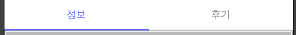

``` swift
		var focusIndex: BehaviorSubject<Int> = BehaviorSubject<Int>(value: 0)

    // 셀모델
     var tabTitle = [ TabModel(title: "동아리 후기", onFocus: true),
                     TabModel(title: "대외활동 후기", onFocus: false),
                     TabModel(title: "인턴 후기", onFocus: false)
                    ]

    // 셀구현
    func collectionView(_ collectionView: UICollectionView, cellForItemAt indexPath: IndexPath) -> UICollectionViewCell {
        let cell = collectionView.dequeueReusableCell(withReuseIdentifier: "ReviewPageCell", for: indexPath) as! ReviewPageCollectionViewCell
        
        cell.tabLabel.text = self.tabTitle[indexPath.item].title
        cell.onFocus = self.tabTitle[indexPath.item].onFocus
        
        return cell
    }

    // 클릭시
    func collectionView(_ collectionView: UICollectionView, didSelectItemAt indexPath: IndexPath) {
        
        let cell = collectionView.cellForItem(at: indexPath) as! ReviewPageCollectionViewCell
        self.tabTitle[indexPath.item].onFocus = true
        cell.onFocus = true
        self.focusIndex.onNext(indexPath.item)
    }
    
    // 클릭 토글시
    func collectionView(_ collectionView: UICollectionView, didDeselectItemAt indexPath: IndexPath) {

        let cell = collectionView.cellForItem(at: indexPath) as! ReviewPageCollectionViewCell
        self.tabTitle[indexPath.item].onFocus = false
        cell.onFocus = false
    }

    // 페이지 이동
    func bindData() {
        let sub = reviewPageInstance.subViewControllers
        
        // 클릭한 인덱스에 따라서 페이지이동
        focusIndex.subscribe(onNext: { index in
            guard self.curIndex != index else { return }
            
            let direction: UIPageViewController.NavigationDirection! = self.curIndex < index ? .forward : .reverse
            self.reviewPageInstance.setViewControllers([sub[index]], direction: direction , animated: true, completion: nil)
            self.curIndex = index
            })
        .disposed(by: disposeBag)
    }

    // 탭 클릭시 이벤트
    func setPageTabStatus(index: Int) {
        
        self.tabCollectionView.deselectItem(at: IndexPath(item: index, section: 0), animated: false)
        self.tabCollectionView.selectItem(at: IndexPath(item: index, section: 0), animated: false, scrollPosition: .left)
        
    }


```

* Cell클릭으로 페이지 처리시
  1. cell의 select, deselect호출
  2. index의값을 Observable에 넘겨줌
  3. subscribe에서 값전달받고 페이지 넘기기


``` swift
     func pageViewController(_ pageViewController: UIPageViewController, didFinishAnimating finished: Bool, previousViewControllers: [UIViewController], transitionCompleted completed: Bool) {
        // 페이지이동시 tab이동
        if completed {
            var index: Int!
            if let curVC = pageViewController.viewControllers?.first as? ClubListViewController {
                index = curVC.pageIndex
            } 
            pageDelegate?.setPageTabStatus(index: index)
        }
        
    }
```


* 슬라이드로 페이지 처리시
  1. 현재페이지의 index를 이용해서 delegate 메소드 호출
  2. 위와 같은 동작


---

---

## 개선후

``` swift
// 뷰모델
class ClubDetailViewModel {
    private init() {}
    static let shared = ClubDetailViewModel()
    
    let tabPageObservable: BehaviorSubject<Int> = BehaviorSubject<Int>(value: 0)
    let tabFirstButtonStatus: BehaviorSubject<Bool> = BehaviorSubject<Bool>(value: true)
    
    func setPage(page: Int) {
        self.tabPageObservable.onNext(page)
    }
    
    func setButton(select: Bool) {
        self.tabFirstButtonStatus.onNext(select)
    }
}

// 뷰모델 바인딩
    func bind() {
      
      // 슬라이드시
        self.tabViewModel.tabPageObservable
            .observeOn( MainScheduler.instance )
            .distinctUntilChanged()
            .subscribe(onNext: { [weak self] page in
                
                guard self?.curPage != page else { return }
                guard let sub = self?.clubPageInstance.subViewControllers else { return }
                
                let direction: UIPageViewController.NavigationDirection! = self!.curPage < page ? .forward : .reverse
                self?.clubPageInstance.setViewControllers([sub[page]], direction: direction , animated: true, completion: nil)
                self?.curPage = page
                if page == 0 {
                    self?.tabViewModel.setButton(select: true)
                } else if page == 1 {
                   self?.tabViewModel.setButton(select: false)
                }
            })
            .disposed(by: disposeBag)
        
      // 버튼클릭시
        self.tabViewModel.tabFirstButtonStatus
            .observeOn( MainScheduler.instance )
            .distinctUntilChanged()
            .subscribe(onNext: { [weak self] b in
                self?.clubInfoButton.isSelected = b
                self?.clubReviewButton.isSelected = !b
                
                if b {
                    self?.infoLineView.backgroundColor = #colorLiteral(red: 0.376783371, green: 0.4170111418, blue: 1, alpha: 1)
                    self?.reviewLineView.backgroundColor = #colorLiteral(red: 0.9333333333, green: 0.9333333333, blue: 0.9333333333, alpha: 1)
                    self?.tabViewModel.setPage(page: 0)
                }else {
                    self?.infoLineView.backgroundColor = #colorLiteral(red: 0.9333333333, green: 0.9333333333, blue: 0.9333333333, alpha: 1)
                    self?.reviewLineView.backgroundColor = #colorLiteral(red: 0.376783371, green: 0.4170111418, blue: 1, alpha: 1)
                    self?.tabViewModel.setPage(page: 1)
                }
            })
            .disposed(by: disposeBag)
    }

    @IBAction func reviewClick(_ sender: Any) {
        self.tabViewModel.tabFirstButtonStatus.onNext(false)
    }
    
    @IBAction func infoClick(_ sender: Any) {
        self.tabViewModel.tabFirstButtonStatus.onNext(true)
    }
```


* 기존의 Cell클릭을 버튼클릭으로 변경
  1. 버튼클릭시 눌렸는지 Bool값 전달
  2. 뷰모델 subscribe에서 클릭값에 맞게 페이지 변경


* 슬라이드 페이징시
  1. 뷰모델 subscribe에서 page인덱스에 맞게 페이지 변경
  2. page인덱스에따라서 버튼상태 변경값 전달