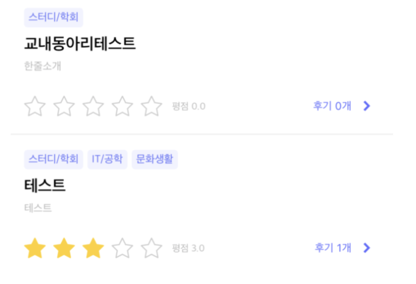

# 카테고리 나열뷰 구현하기


<div>

</div>

</br>

* [TableView Row에 CollectionView Cell로 구현](#CollectionView이용)
* [TableView Row에 StackView로 구현](#StackView이용)
* [생각해보기](#생각해보기)

</br>

***

</br>

## CollectionView이용

``` swift
extension ClubListTableViewCell: UICollectionViewDataSource, UICollectionViewDelegateFlowLayout {
    func collectionView(_ collectionView: UICollectionView, numberOfItemsInSection section: Int) -> Int {
        return self.categorySet.count
    }
    
    func collectionView(_ collectionView: UICollectionView, cellForItemAt indexPath: IndexPath) -> UICollectionViewCell {
        let cell = collectionView.dequeueReusableCell(withReuseIdentifier: "ClubListCategoryCell", for: indexPath) as! ClubCategoryCollectionViewCell
        
        cell.categoryLabel.text = self.categorySet[indexPath.row]
        
        return cell
    }
    
    // String에 폰트를 적용하고 라벨크기를 계산해서 cell의 크기를 설정
    func collectionView(_ collectionView: UICollectionView, layout collectionViewLayout: UICollectionViewLayout, sizeForItemAt indexPath: IndexPath) -> CGSize {
        
        let title = self.categorySet[indexPath.row]
        let width = title.estimatedFrame(font: UIFont.fontWithName(type: .regular, size: 10)).width
        
        return CGSize(width: width + 8, height: 18)
    }
    
    func collectionView(_ collectionView: UICollectionView, layout collectionViewLayout: UICollectionViewLayout, minimumInteritemSpacingForSectionAt section: Int) -> CGFloat {
        return 4
    }
}
```


</br>


## StackView이용


``` swift
// 라벨 커스텀
class CategoryView: UILabel {
    //카테고리가 보여질 배경넓이 설정
    override var intrinsicContentSize: CGSize {
        var contentSize = super.intrinsicContentSize
        contentSize.height += 8
        contentSize.width += 8
        return contentSize
    }
    
    convenience init(text: String) {
        self.init(frame: .zero)
        configure(text: text)
    }
    
    //라벨 속성 설정
    func configure(text: String) {
        
        self.backgroundColor =  colorLiteral(red: 0.3960784314, green: 0.431372549, blue: 0.9411764706, alpha: 0.08)
        self.layer.cornerRadius = 3
        self.font = UIFont(name: “AppleSDGothicNeo-Regular”, size: 10.0)
        self.textColor = .cornFlower
        self.text = text
        self.textAlignment = .center
    }
}

// 라벨이 들어갈 스텍뷰설정
class CategoryList: UIStackView {
    // 오토레이아웃 설정해주기
    override func addSubview(_ subview: UIView) {
        let contraintLast = self.subviews.last?.trailingAnchor ?? self.leadingAnchor
        super.addSubview(subview)
        
        subview.translatesAutoresizingMaskIntoConstraints = false
        subview.heightAnchor.constraint(equalTo: self.heightAnchor).isActive = true
        subview.leadingAnchor.constraint(equalTo: contraintLast, constant: 4).isActive = true
    }
}
```

> TableView Cell에 적용

``` swift
class ReviewSearchTableViewCell: UITableViewCell {
    
    let categoryStack = CategoryList()
   
    override func awakeFromNib() {
        super.awakeFromNib()
    }
  
    func categoryFactory(labels: [String]) {
        self.addSubview(categoryStack)
        
        // 스텍뷰 오토레이아웃 설정
        categoryStack.translatesAutoresizingMaskIntoConstraints = false
        categoryStack.heightAnchor.constraint(equalToConstant: 18).isActive = true
        categoryStack.leadingAnchor.constraint(equalTo: self.leadingAnchor, constant: 20).isActive = true
        categoryStack.topAnchor.constraint(equalTo: self.topAnchor, constant: 14).isActive = true
        categoryStack.trailingAnchor.constraint(equalTo: self.trailingAnchor, constant: -24).isActive = true
        
        // 커스텀 라벨로 생성
        labels.compactMap {
            let lable = CategoryView(text: $0)
            return lable
        } // 스텍뷰에 넣어주기
        .forEach {
            categoryStack.addSubview($0)
        }
        self.layoutIfNeeded()
    }
    
    func bind(viewModel: ReviewSearchViewModel) {
        categoryFactory(labels: viewModel.cellModel)
    }
    
}
```


</br>

***

### 생각해보기

* 동적인 부분에서는 차이가 없다
* 아무런 동작없이 보여주기만 하고 한 줄로 이루어진 카테고리 리스트는 CollectionView보다는 StackView로 구현하는게 더 나은것 같다
  * 아무런 이벤트도 받을 필요없고, 스크롤도 필요 없기 때문에 TableView안에 CollectionView쓰는 것을 지양하는게 좋을 것 같다.
* 한 줄이 아닌 여러줄로 나타내는 구현이 필요하다면 한 줄밖에 못보여주는 StackView 보다는 CollectionView로 구현하는게 더 나은것 같다
  * 이 때도 아무런 이벤트를 안 받지만 StackView로는 2줄이상의 리스트를 표현 할 수 없다.
* 리스트에 버튼이 포함되어 있어서 삭제할 수 있는 기능이 있다면??
  * CollectionView로 구현하는게 더 효율적 인것같다.
    * View 커스텀, Label 커스텀, Button 커스텀 다 해줘야 하는 번거러움
  * 버튼의 tag를 이용하여 어느 Cell이 눌렸는지 판단하고 처리가능