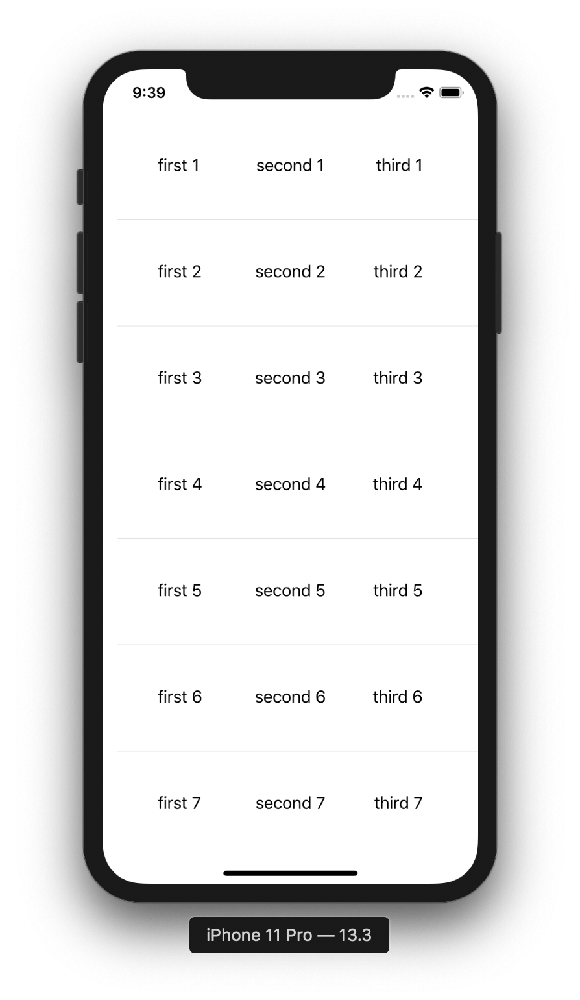

# TableView Bind Data

<div align="center">

</div>

<br>

* UI에 직접설정
* didSet, willSet 사용
* Binding 사용

<br>

> ## 샘플 데이터
``` swift
struct TestModel {
    let firstText: String
    let secondText: String
    let thirdText: String
    
    init(num: Int) {
        firstText = "first \(num)"
        secondText = "second \(num)"
        thirdText = "third \(num)"
    }
}

class TableBindViewController: UIViewController {
    @IBOutlet weak var tableView: UITableView!
    let testModel: [TestModel] = [TestModel(num: 1),TestModel(num: 2),TestModel(num: 3),TestModel(num: 4),TestModel(num: 5),TestModel(num: 6),TestModel(num: 7),TestModel(num: 8),TestModel(num: 9),TestModel(num: 10),TestModel(num: 11),TestModel(num: 12),TestModel(num: 13),TestModel(num: 14),TestModel(num: 15)]
    override func viewDidLoad() {
        super.viewDidLoad()
        setupTableView()
    }
    
    func setupTableView() {
        tableView.dataSource = self
    }
}
```
***

<br>

> ## UI에 직접설정
``` swift
extension TableBindViewController: UITableViewDataSource {
    func tableView(_ tableView: UITableView, numberOfRowsInSection section: Int) -> Int {
        testModel.count
    }
    
    func tableView(_ tableView: UITableView, cellForRowAt indexPath: IndexPath) -> UITableViewCell {
        guard let cell = tableView.dequeueReusableCell(withIdentifier: "TableBindCell", for: indexPath) as? TableBindTableViewCell else {
            return UITableViewCell(style: .default, reuseIdentifier: "")
        }
        cell.firstLabel.text = testModel[indexPath.row].firstText
        cell.secondLabel.text = testModel[indexPath.row].secondText
        cell.thirdLabel.text = testModel[indexPath.row].thirdText
        return cell
    }
}

```

<br>

> > ## didSet, willSet 사용
* Property Observer
* didSet
  * oldValue - 변겅되기 전의 값
* willSet
  * oldValue - 변경되기 전의 값
  * newValue - 변겅 되는 값
* 복잡한 로직없는 데이터를 보여줄 때 용이
``` swift
extension TableBindViewController: UITableViewDataSource {
    func tableView(_ tableView: UITableView, numberOfRowsInSection section: Int) -> Int {
        testModel.count
    }
    
    func tableView(_ tableView: UITableView, cellForRowAt indexPath: IndexPath) -> UITableViewCell {
        guard let cell = tableView.dequeueReusableCell(withIdentifier: "TableBindCell", for: indexPath) as? TableBindTableViewCell else {
            return UITableViewCell(style: .default, reuseIdentifier: "")
        }
        cell.model = testModel[indexPath.row]
        return cell
    }
}
```
``` swift
class TableBindTableViewCell: UITableViewCell {

    @IBOutlet weak var thirdLabel: UILabel!
    @IBOutlet weak var secondLabel: UILabel!
    @IBOutlet weak var firstLabel: UILabel!
    
    var model: TestModel? {
        willSet {
            firstLabel.text = newValue?.firstText
            secondLabel.text = newValue?.secondText
            thirdLabel.text = newValue?.thirdText
        }
    }
    
    override func awakeFromNib() {
        super.awakeFromNib()
     
    }

    override func setSelected(_ selected: Bool, animated: Bool) {
        super.setSelected(selected, animated: animated)

    }
}

```

<br>

> ## Binding 사용
* model과 service등을 주입 용이
``` swift
extension TableBindViewController: UITableViewDataSource {
    func tableView(_ tableView: UITableView, numberOfRowsInSection section: Int) -> Int {
        testModel.count
    }
    
    func tableView(_ tableView: UITableView, cellForRowAt indexPath: IndexPath) -> UITableViewCell {
        guard let cell = tableView.dequeueReusableCell(withIdentifier: "TableBindCell", for: indexPath) as? TableBindTableViewCell else {
            return UITableViewCell(style: .default, reuseIdentifier: "")
        }
        cell.bind(model: testModel[indexPath.row])
        return cell
    }
}
```

``` swift
class TableBindTableViewCell: UITableViewCell {

    @IBOutlet weak var thirdLabel: UILabel!
    @IBOutlet weak var secondLabel: UILabel!
    @IBOutlet weak var firstLabel: UILabel!
    
    override func awakeFromNib() {
        super.awakeFromNib()
     
    }

    func bind(model: TestModel) {
        firstLabel.text = model.firstText
        secondLabel.text = model.secondText
        thirdLabel.text = model.thirdText
    }
    
    override func setSelected(_ selected: Bool, animated: Bool) {
        super.setSelected(selected, animated: animated)

    }
}
```

<br>

## LifeCycle

* awakeFromNib
  * 초기화 작업준비
* cellForRowAt
  * 삽입할 셀 요청
* willDisplay
  * 그리기 직전에 호출
* prefetch
  * 보여지는 셀 이외의 셀 정보를 호출하여 받아올 수 있음
* didEndDisplay
  * Cell이 사라지면 호출
* prepareForReuse
  * 재사용 Cell 준비

<br>

## Event Handler
* Delegate
* Notification
* Property Observer
* Injection
  * addTarget
  * closure
``` swift
    func tableView(_ tableView: UITableView, cellForRowAt indexPath: IndexPath) -> UITableViewCell {
        guard let cell = tableView.dequeueReusableCell(withIdentifier: "TableBindCell", for: indexPath) as? TableBindTableViewCell else {
            return UITableViewCell(style: .default, reuseIdentifier: "")
        }
        cell.testString = String(indexPath.row)
        cell.insertHandler { print("\n--\($0)") }
        return cell
    }
```
``` swift
class TableBindTableViewCell: UITableViewCell {

    typealias Handler = (String) -> Void
    var handler: Handler?
    var testString: String? {
        willSet {
            handler?(newValue!)
        }
    }
    
    func insertHandler(handler: Handler?) {
        self.handler = handler
        handler?(testString!)
    }
    
    override func awakeFromNib() {
        super.awakeFromNib()   
    }
}

```

<br>

## TIP

<div align="center">

</div>

> ### Refresh
``` swift
    func setupTableView() {
        tableView.dataSource = self
        tableView.delegate = self
        
        let refreshControl = UIRefreshControl()
        refreshControl.tintColor = UIColor(red:0.25, green:0.72, blue:0.85, alpha:1.0)
        let attribute = [NSAttributedString.Key.font: UIFont.systemFont(ofSize: 20, weight: .heavy)]
        refreshControl.attributedTitle = NSAttributedString(string: "Refreshing...", attributes: attribute)
        refreshControl.transform = CGAffineTransform(scaleX: 0.87, y: 0.87)
        refreshControl.addTarget(self, action: #selector(refresh), for: .valueChanged)
        tableView.refreshControl = refreshControl
    }
    
    @objc func refresh() {
        print("refresh")
        DispatchQueue.main.asyncAfter(deadline: .now() + 2) {
            self.tableView.refreshControl?.endRefreshing()
        }
    }
```

<br>

> ### willDisplay
* 무한 스크롤 구현시 사용
* 자연스러운 생성 애니메이션시 사용
* Cell을 그리기전에 호출
``` swift
    func tableView(_ tableView: UITableView, willDisplay cell: UITableViewCell, forRowAt indexPath: IndexPath) {
        guard !isLoading else {
            return
        }
        let cellCount = vcType == Type.A ? A.count : B.count
        if indexPath.row == cellCount-1 {
            isLoading = true
            self.curPage += 1
        }
    }
```

<br>

> ## scrollViewWillEndDragging
* 페이징 처리
* 손때면 바로 호출
* withVelocity - 좌우 방향 가속도
* targetContentOffset - 도착지점
``` swift
    func scrollViewWillEndDragging(_ scrollView: UIScrollView, withVelocity velocity: CGPoint, targetContentOffset: UnsafeMutablePointer<CGPoint>) {
    
        let offset = targetContentOffset.pointee
        let cellWidthIncludingSpacing = self.collectionView.frame.width
        // 방향에따라 x, y
        let index = Int(offset.x / cellWidthIncludingSpacing)
        
        photoCurIndex.accept(index)
    }
```